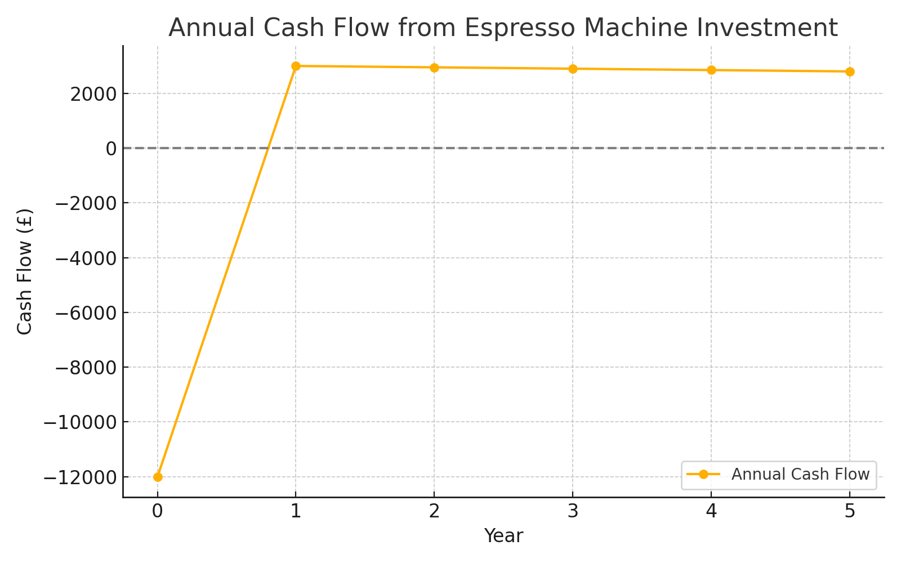
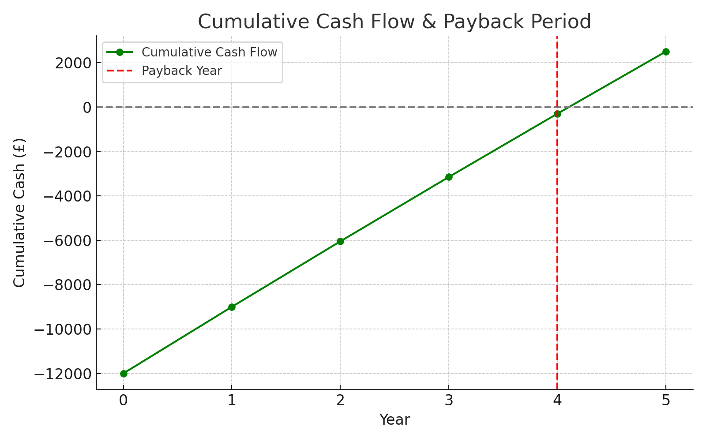

# ☕ Espresso Machine Investment Case Study

This project analyzes the financial viability of investing in a high-efficiency espresso machine for a small coffee business. Using corporate finance tools, we evaluate whether this £12,000 investment is justified over a 5-year horizon.

---

## 🎯 Objective

Determine whether a £12,000 espresso machine will result in sufficient operational savings and profitability using:
- Net Present Value (NPV)
- Internal Rate of Return (IRR)
- Payback Period
- Sensitivity Analysis

---

## 📊 Methodology

- **Annual Savings**: £3,200  
- **Maintenance Costs**: £200 (Year 1) → £400 (Year 5)  
- **Discount Rate**: 10%  
- **Forecast Period**: 5 Years

All calculations were performed using Excel and Python. Two key visualizations were created to summarize the investment analysis.

---

## 📈 Key Results

| Metric                    | Value     |
|---------------------------|-----------|
| Net Present Value (NPV)   | £2,274.72 |
| Internal Rate of Return   | 18.18%    |
| Payback Period            | 4 Years   |

---

## 📉 Visualizations

### 📌 Annual Cash Flow
Shows yearly net inflows from savings minus maintenance.

---

### 📌 Cumulative Cash Flow
Indicates breakeven is achieved within 4 years.

---

## 🔍 Sensitivity Analysis

We tested:
- **Discount Rates**: 8%, 10%, 12%
- **Annual Savings**: £2,800, £3,200, £3,600

Results show investment is viable under most realistic assumptions.

---

## 📁 Project Files

- `Espresso_Investment_Case_Study.xlsx` – Cash flows + sensitivity model
- `Enhanced_Espresso_Investment_Report_Mayank_Agarwal.docx` – Final professional report
- `README.md` – This file with all methodology, results, and links

---

## 👨‍💼 Author

**Mayank Agarwal**  
MSc Financial Technology | University of Liverpool  
📧 agarwalmayank517@gmail.com  
🔗 [LinkedIn](https://www.linkedin.com/in/mayank-agarwal-fintech/)

---

## ✅ Conclusion

The investment is financially sound with robust indicators, reinforcing how small-scale businesses can make data-driven investment decisions using traditional finance techniques.

